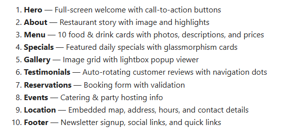
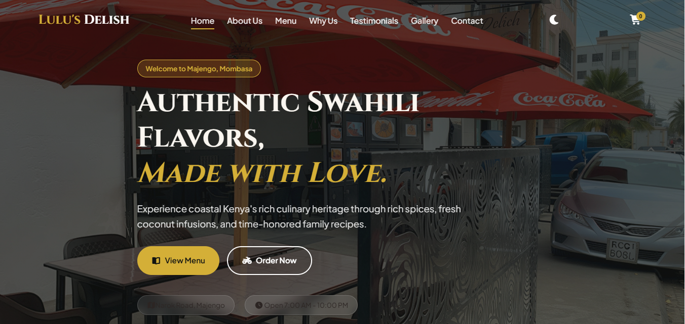
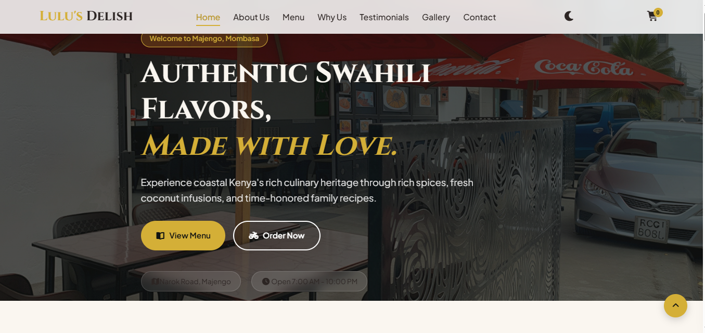

# Lulu's Delish — Swahili Restaurant Website & Digital Menu

> **Authentic Swahili Flavors, Made with Love.**  
> A modern, mobile-first, responsive web application for *Ulu's Delish*, a family-friendly coastal Swahili restaurant located along Narok Road, Majengo, Mombasa, Kenya.

---

## Features

### Design & Experience

- **Coastal Swahili Aesthetic:** Warm earthy color palette featuring cream, gold, deep green, and rich wood tones.
- **Glassmorphism UI:** Translucent cards and backdrop filters for a modern look.
- **Dark / Light Mode:** Persistent theme toggle using `localStorage`.
- **Mobile-First Responsive Design:** Seamless layout adaptivity for mobile devices, tablets, and desktops.
- **Rich Animations:** Scroll reveal triggers, floating cards, smooth hovers, and parallax hero image effect.

### Digital Menu & Ordering System

- **Interactive Category Filtering:** Filter dishes by *Breakfast, Lunch, Dinner, Drinks, Desserts,* and *Specials*.
- **Real-Time Search:** Instantly filter dishes by name or description.
- **Slide-Out Order Drawer:** Interactive cart to adjust quantities and calculate totals in Kenyan Shillings (KSh).
- **Direct WhatsApp Ordering:** One-click checkout that automatically formats the customer's cart into a WhatsApp message directed to the restaurant hotline (`0707 729549`).

### Visuals & Engagement

- **Masonry Gallery & Lightbox:** Interactive modal viewing for dish and restaurant photos.
- **Testimonials Slider:** Automated feedback carousel showcasing customer reviews.
- **Location & Booking:** Integrated Google Maps embed, service indicators (Dine-in, Kerbside Pickup, Delivery), opening hours, and a contact form.

---

## Built With

- **HTML5:** Semantic structural elements (`header`, `main`, `section`, `aside`, `footer`).
- **CSS3:** Modern CSS variables, Flexbox, Grid layout, glassmorphism filters, keyframe animations, and media queries. *(No frameworks used)*.
- **Vanilla JavaScript (ES6+):** Dynamic DOM manipulation, array filtering algorithms, intersection observers, and theme state persistence. *(No libraries used)*.

- **Icons & Fonts:** 

  - [FontAwesome 6](https://fontawesome.com/)
  - [Google Fonts](https://fonts.google.com/) (*Cinzel* & *Plus Jakarta Sans*)

---

## Project Structure

```text
ulus-delish/
├── index.html        # Main HTML structure & accessibility tags
├── styles.css        # Theme variables, layouts, glassmorphism & responsive styles
├── script.js        # Menu filtering, search logic, cart drawer & theme switcher
└── README.md         # Project documentation

```

## check out logic

### Step 1

The user clicks "Proceed to Checkout".

If the cart is empty: Show an alert message and stop.

If the cart has items: The form slides open (.active), the button text changes to "Send Order via WhatsApp", and focus shifts to the name input.

### Step 2

 The user fills out their details and clicks "Send Order via WhatsApp".

Validates that Name, Phone, and Address are filled.

Formats the WhatsApp message including customer details and itemized totals.

Opens WhatsApp in a new tab/whasapp app.

### Step 3

Cart Auto-Reset: If items are removed until the cart becomes empty, the form automatically collapses back and the button resets to "Proceed to Checkout".



## Installation & Local Setup

### Clone or Download the Repository

git clone [https://github.com/your-username/ulus-delish.git](https://github.com/your-username/ulus-delish.git)
cd ulus-delish

### Run the Application

Simply double-click index.html to open it in your default web browser.

Or use VS Code's Live Server extension for real-time previewing.

## Restaurant Details

Location: Narok Road, Majengo, Mombasa, Kenya

Price Range: KSh 500 – 1,000 per person

Opening Hours: Monday – Sunday (7:00 AM – 10:00 PM)

Phone / WhatsApp: +254 707 729 549

Services: Dine-in | Kerbside Pickup | Fast Delivery

## Photos





## License

This project is open-source and available under the MIT License
